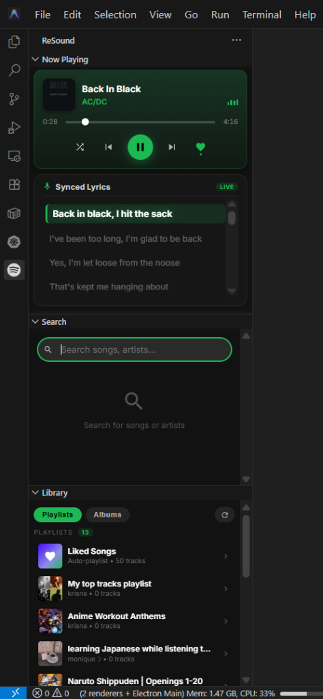
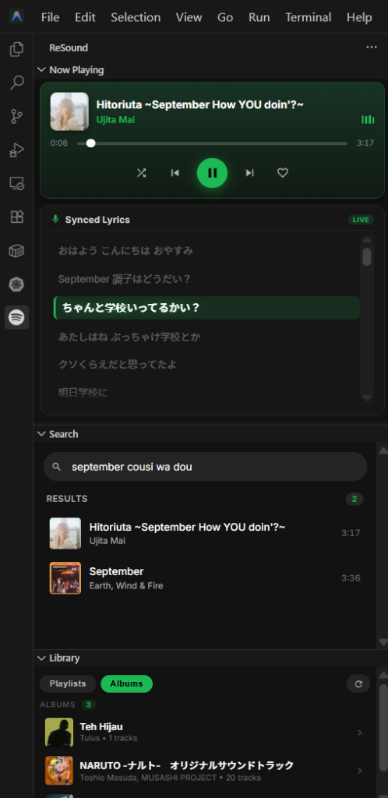
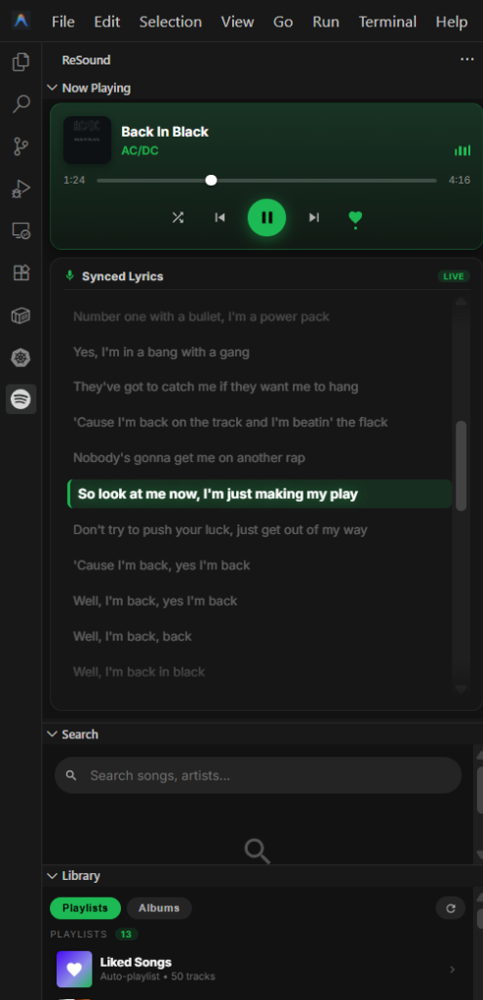
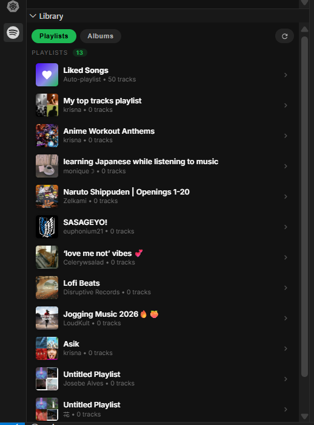
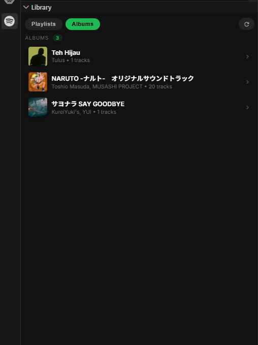

# ReSound

[](https://code.visualstudio.com/)
[](https://www.typescriptlang.org/)
[](LICENSE)
[](https://github.com/krisnarhesa/resound)

**ReSound** is an enterprise-grade, high-performance Spotify integration and real-time synchronized lyrics extension engineered for Visual Studio Code and Antigravity IDE. It delivers a native, zero-latency desktop playback controller alongside 60FPS time-synced karaoke lyrics directly within the editor sidebar.

---

## Overview

ReSound is inspired by the foundational concepts of `vscode-spotify`. While legacy implementations centered around basic status bar items, ReSound has been completely overhauled and refactored into a full-featured **Sidebar Activity Bar container**. It features high-precision Webview controllers, live 60FPS karaoke lyrics sync, instant track & artist search, and direct Spotify REST API integration.

ReSound avoids legacy platform-specific IPC bottlenecks (such as D-Bus on Linux or AppleScript on macOS), delivering smooth, responsive performance across all major operating systems.

### System Architecture Flow

- **VS Code / Antigravity IDE** ⟷ *(Webview Message IPC & Live State Push)* ⟷ **ReSound Extension Host**
- **ReSound Extension Host** ⟷ *(REST API & 800ms Polling)* ⟷ **Spotify Web API**
- **ReSound Extension Host** ⟷ *(HTTP GET)* ⟷ **LRCLIB Lyrics Service**

## Showcase

<div align="center">
  <p>
    
    &nbsp;
    
  </p>
  <p>
    
    &nbsp;
    
    &nbsp;
    
  </p>
</div>

---

## Key Features

### 1. Spotify Desktop Parity and Playback Controls

- **Familiar Vertical Layout**: Integrates into the editor sidebar with Track Information, Seek Progress Bar, Shuffle, Previous, Play/Pause, Next, and Favorite toggle.
- **Real-time Liked Songs Sync**: Like or unlike any track on the fly with immediate visual feedback and automatic library synchronization.
- **1-Click OAuth Integration**: Connect your Spotify account directly via `resound.krisnarhesa.dev` with automatic background token refresh.

### 2. 60FPS Real-Time Synced Lyrics Engine

- **Microsecond Interpolation**: Utilizes `requestAnimationFrame` with high-resolution `performance.now()` benchmarking to render smooth 60FPS lyric highlighting.
- **Multi-Language Support**: Full support for English, Japanese, Indonesian, Korean, and worldwide lyrics with automated fallback.
- **Anti-Latency Compensation**: Audio buffer offset alignment ensures lyrics highlight precisely in sync with playback.

### 3. Live Track and Artist Search

- **Instant Query Ingestion**: Debounced 220ms live search returns top tracks with duration and cover art as you type.
- **Queue Ingestion**: Selecting any search result immediately plays the track and queues up the surrounding results.

### 4. Playlists, Albums and Liked Songs Hub

- **Pinned Liked Songs**: Dedicated Liked Songs hub with authentic Spotify gradient styling and live track counts.
- **Robust Track Loading**: Direct endpoint ingestion ensures all tracks load cleanly with full metadata.

---

## Extension Commands

| Command Identifier     | Category & Title                                | Description                                                     |
| :--------------------- | :---------------------------------------------- | :-------------------------------------------------------------- |
| `resound.playPause`    | `ReSound: Play / Pause`                         | Toggles the active playback state.                              |
| `resound.next`         | `ReSound: Next Track`                           | Skips to the next track in the queue context.                   |
| `resound.previous`     | `ReSound: Skip Back`                            | Returns to the previous track in the queue context.             |
| `resound.searchTracks` | `ReSound: Search Tracks & Artists`              | Opens the live search view and focuses the input query bar.     |
| `resound.signIn`       | `ReSound: Log In with Spotify`                  | Initiates the Spotify OAuth authentication sequence.            |
| `resound.signOut`      | `ReSound: Log Out`                              | Clears stored authorization tokens and resets extension state.  |
| `resound.manualSignIn` | `ReSound: Authentication Options / Enter Token` | Select login method (OAuth, manual bearer token, or Client ID). |

---

## Configuration Reference

Configure ReSound within your workspace `settings.json`:

```json
{
  "spotify.authServerUrl": "https://resound.krisnarhesa.dev",
  "spotify.clientId": "",
  "spotify.enableLogs": false
}
```

### Keybindings Specification

Add custom keybindings inside `keybindings.json`:

```json
[
  {
    "command": "resound.playPause",
    "key": "ctrl+alt+space"
  },
  {
    "command": "resound.next",
    "key": "ctrl+alt+right"
  },
  {
    "command": "resound.previous",
    "key": "ctrl+alt+left"
  }
]
```

---

## Technical Specifications & Architecture

- **Runtime**: Node.js v18+ / VS Code Extension API `>=1.73.0`
- **Language**: TypeScript 5.0 (Strict Type Checking)
- **Network Protocol**: HTTPS / REST JSON API
- **Graphics Rendering**: HTML5 / CSS3 Glassmorphic Styling (`requestAnimationFrame` continuous loop)

---

## License

Distributed under the [MIT License](LICENSE).

---

## Support

ReSound is an open-source passion project. If this extension helps you stay productive (and sane) while coding, consider supporting the development! ☕✨

<p>
  <a href="https://saweria.co/krisnarhesa" target="_blank">
    
  </a>
  &nbsp;
  <a href="https://trakteer.id/krisnarhesa" target="_blank">
    
  </a>
  &nbsp;
  <a href="https://buymeacoffee.com/krisnarhesa" target="_blank">
    
  </a>
</p>
